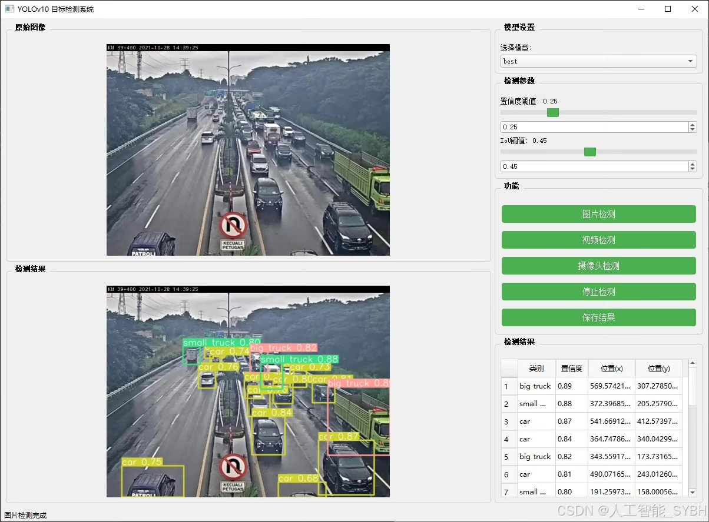
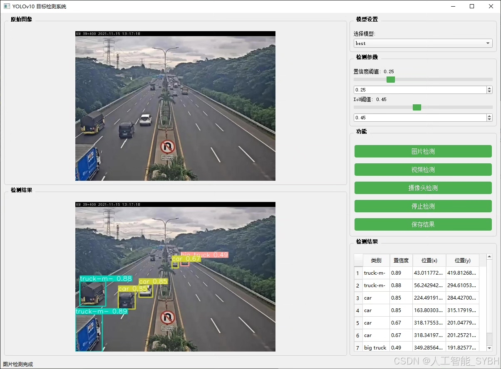
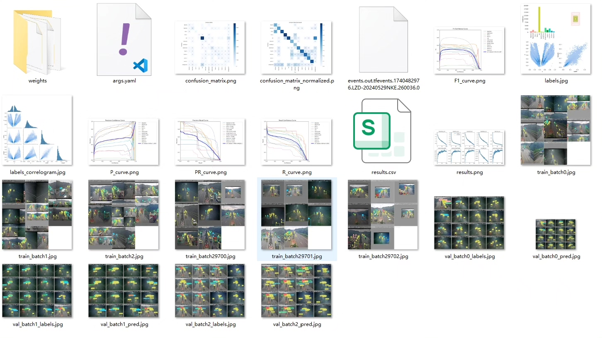
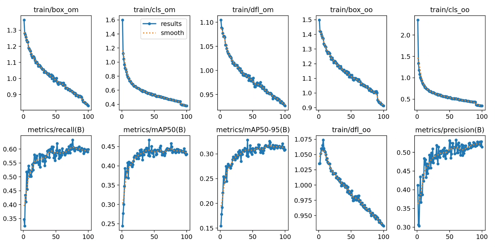
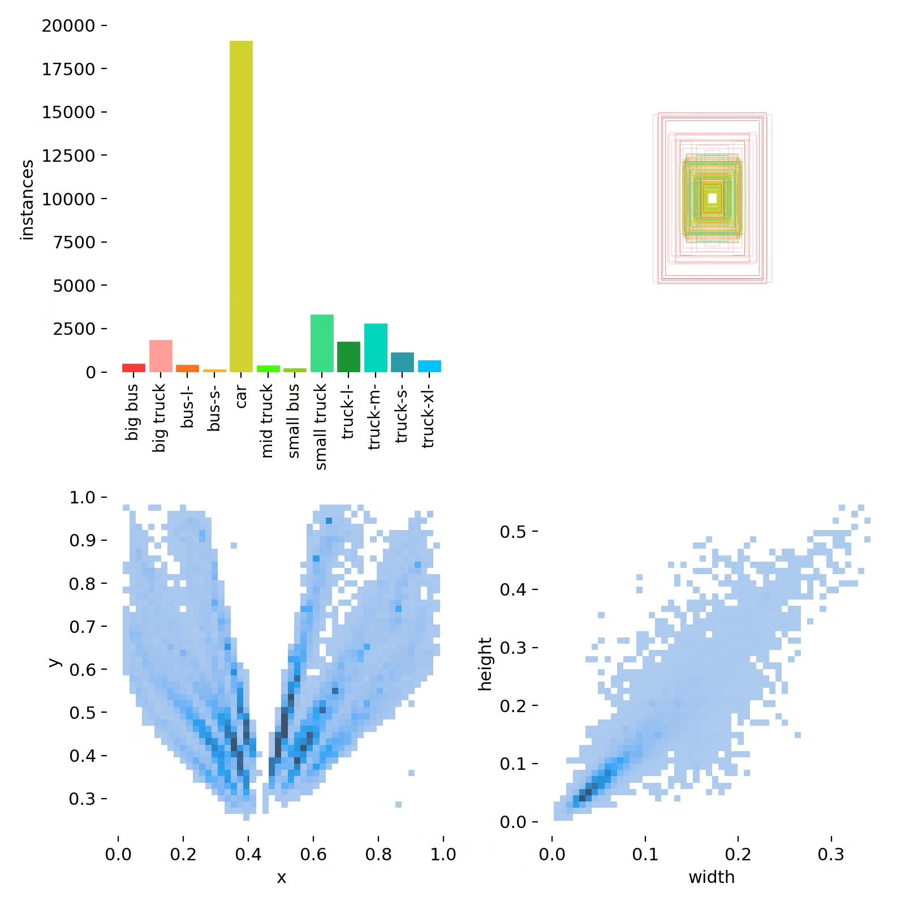
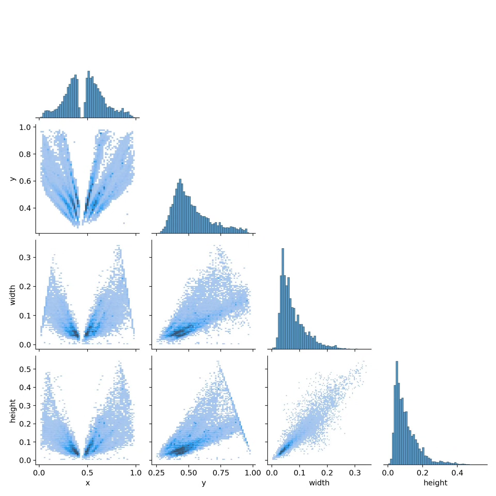
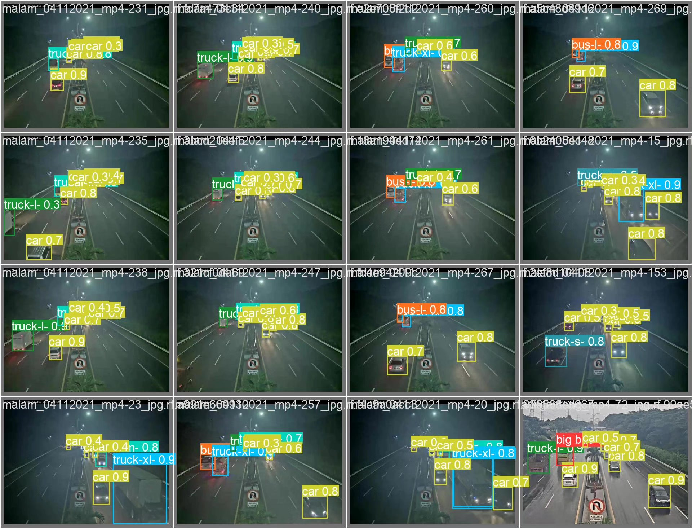
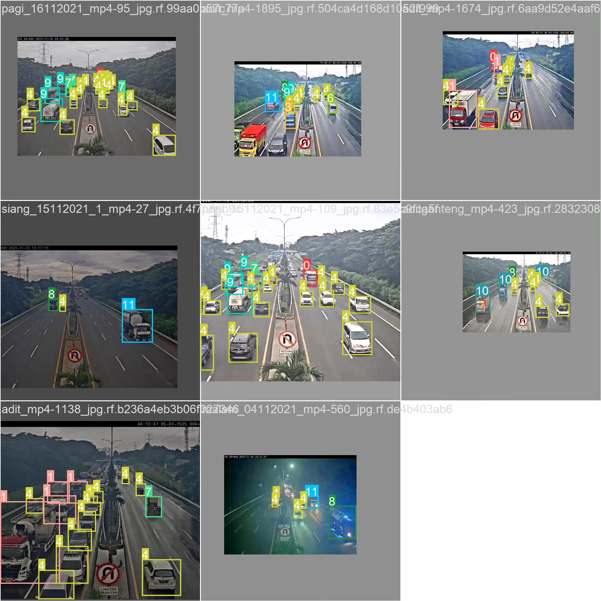

# Vehicle type recognition detection system based on YOLOv10 deep learning (YOLOv)

## Body

Based on the YOLOv10 deep learning algorithm, this project develops an efficient vehicle type recognition detection system. This system can automatically detect vehicles from traffic images or videos and distinguish the types of vehicles (such as large buses, large trucks, small buses, small trucks, and cars), providing support for traffic management and autonomous driving.

The company's products have been granted the official commercial license certification by YOLO.

We provide after-sales service.

After payment, we will provide a WeChat ID to answer questions anytime.

Environment configuration: We will provide a tutorial on environment configuration, and WeChat will provide answers.

Remote installation service: If you need remote configuration, an additional fee of 69 is required, and all fees will be refunded if the configuration fails (specially for older computers only refund installation fees).

Retraining dataset: After setting up the environment, you can train on your own computer. If you need us to retrain, just pay 69 plus computing power fees (2.5 yuan/hour).

Full after-sales service

## Images

## Payment

Here is a pay link on Stripe ( https://buy.stripe.com/3cs8yP7sY87d0vu9AB ). Please contact me lonlonago@foxmail.com after funding $89, and I will send you a complete data files , thank you!

